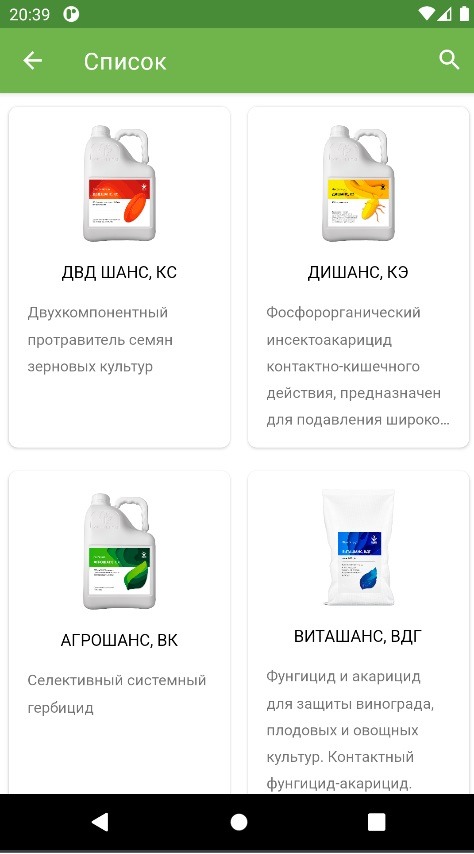

# О приложении

Тестовое задание на должность Junior Android Developer компании Айпартнер|Бинет (Figma внутри):
http://market.d1.i-partner.ru/api/test
---

# Возможности приложения
### 1. Главный экран (Список) 
- на главнм экране отображается список товаров
- список подгружается постранично
- поиск по списку выполняется через поле поиска в Апп-баре
- при ошибке сервера формируется предупреждение с возможностью повторной загрузки

          

### 2. Экран информации по товару
- отображается описание товара
- отображается фото товара
- отображается иконка категории
- отображается чек-бокс "Любимый товар" (без реализации логики)

    

# Используемые технологии
- Kotlin + Coroutines
- Paging Library v3
- Clean Architecture
- Flow + LiveData
- Retrofit
- Hilt
- Glide
- Jetpack Navigation

